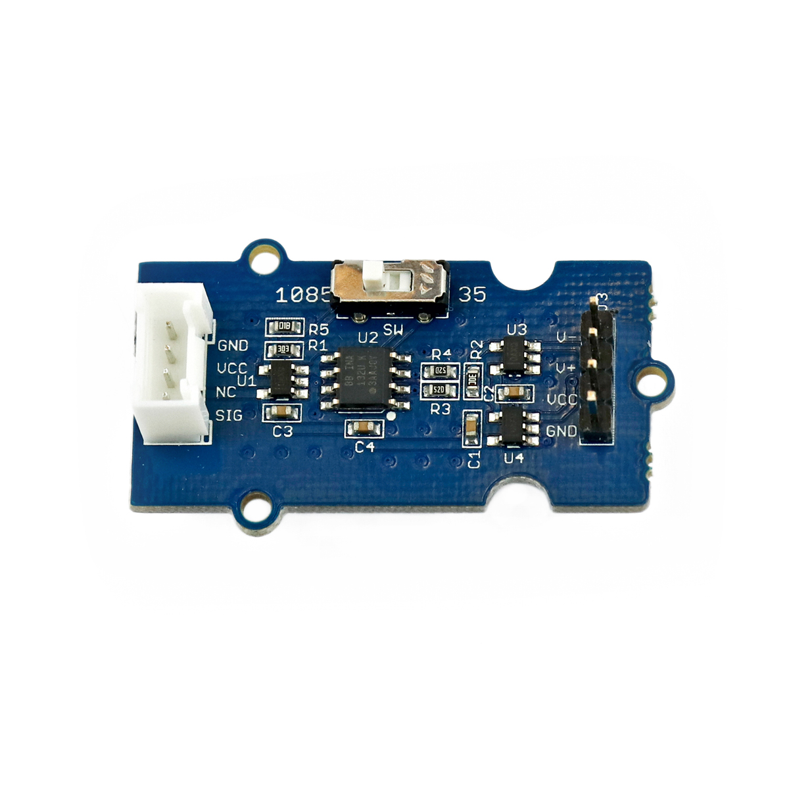

# Verstärker

## Beschreibung
Das Verstärker-Modul ermöglicht es, kleine Spannungen zu verstärken, um sie beispielweise für einen Mikrocontroller messbar zu machen. So können Spannungen erfasst werden, die in ihrer ursprünglichen Form zu klein für die direkte Erfassung mit einem Mikrocontroller sind.

Das Board wird dafür ausgangsseitig direkt oder mithilfe des Grove Shields an einen Arduino oder Raspberry Pi an einen analogen Pin angeschlossen. Eingangsseitig wird die zu messende Spannung angeschlossen.

Auf der Platine können schließlich zwei verschiedene Verstärkungsfaktoren ausgewählt werden: 304 oder 971. Die Ausgangsspannung wird folgendermaßen berechnet:

 

 

 

Mithilfe dieser Platine kann beispielsweise ein Berührungssensor aufgebaut werden. Hierfür wird der berührende Finger gedanklich in Reihe mit einem hohen Widerstand zwischen Versorgungsspannung und Masse gelegt. Werden die offenen Kabel gleichzeitig berührt fließt ein sehr kleiner Strom. Am zweiten Widerstand wird schließlich die abfallende Spannung mithilfe des Verstärkers gemessen und damit die Berührung detektiert.

ACHTUNG: Hiermit können keine Spannungsquellen oder Stromversorgungen umgewandelt werden. Es dient lediglich der Messung oder Erfassung von Spannungen.

Alle weiteren Hintergrundinformationen sowie ein Beispielaufbau und alle notwendigen Programmbibliotheken sind auf dem offiziellen Wiki (bisher nur in englischer Sprache) von Seeed Studio zusammengefasst. Zusätzlich findet man über alle gängigen Suchmaschinen durch die Eingabe der genauen Komponentenbezeichnung entsprechende Projektbeispiele und Tutorials.

<!-- infolist -->

## Wichtige Links für die ersten Schritte:

- [Seeed Studio Wiki](http://wiki.seeedstudio.com/Grove-Differential_Amplifier_v1.0/) [- Verstärker](http://wiki.seeedstudio.com/Grove-Differential_Amplifier_v1.0/)

